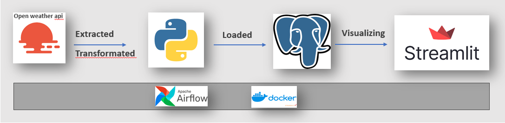
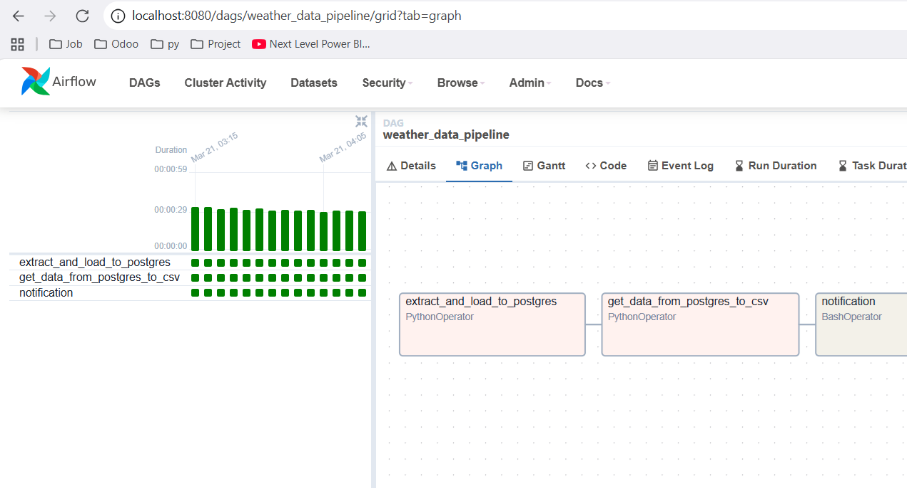
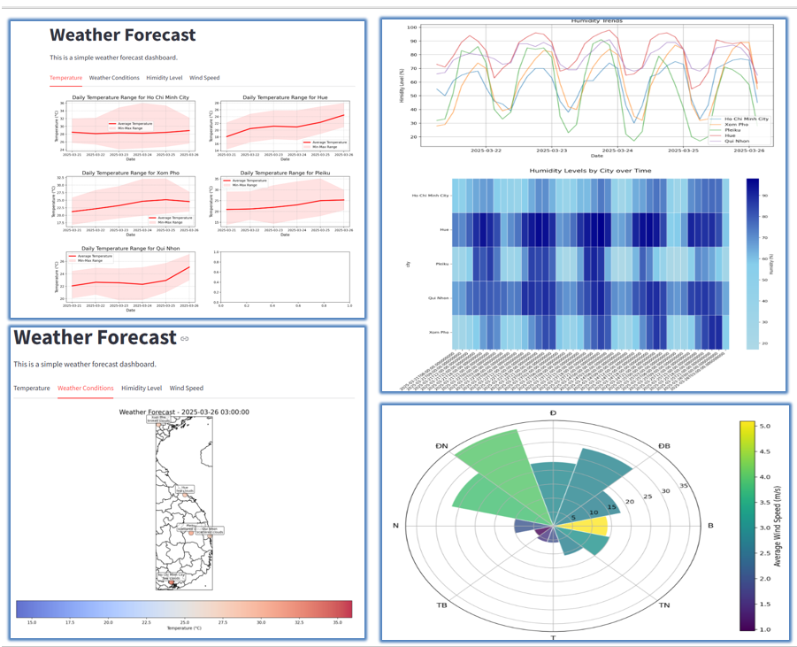

### 1. **Architecture**
 

This project implements a data pipeline designed for processing and visualizing weather data. The pipeline includes the following steps:
1. **Extraction**: Weather data is extracted from the Open Weather API.
2. **Transformation**: Extracted data is processed and transformed using Python scripts.
3. **Loading**: The processed data is stored in a PostgreSQL database.
4. **Visualization**: The data is displayed through a Streamlit application.

### 2. **Airflow**

### 3. **Streamlit**
   - Streamlit is used to visualize key metrics.
    

   
